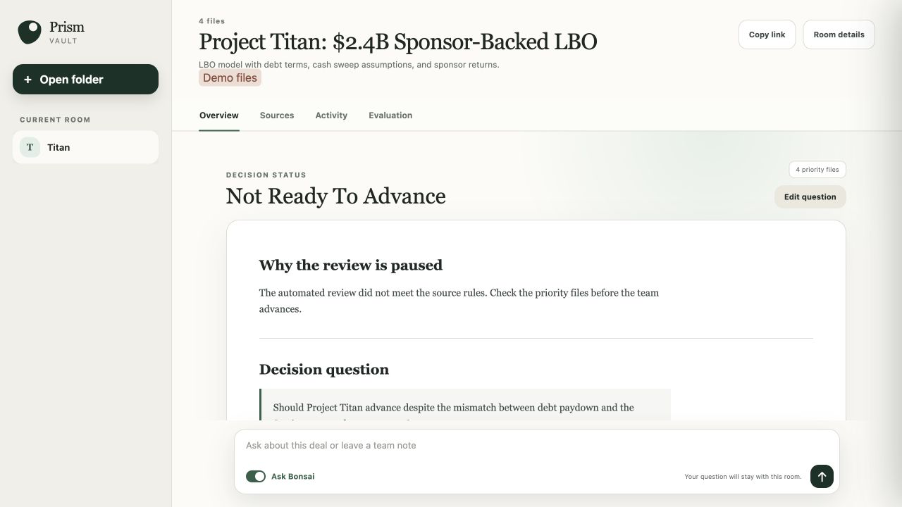

# Hybrid AI Blueprints

Hybrid AI Blueprints is a catalog of runnable AI agent systems. Each blueprint
combines a model, a harness, an interface, and evaluations for one defined job.

PrismML sponsors and stewards the project. The blueprint contracts remain
model and provider neutral, so a team can compare local, cloud, and hybrid
configurations without changing the task or the grading rules.



The first public demo uses a synthetic leveraged buyout folder. The screenshot
shows a guarded result that was paused because the model draft did not meet the
source rules.

## Start with the deal room analyst

The first blueprint reads an authorized M&A folder and prepares a source linked
first pass underwriting brief. The brief helps a deal professional decide
whether to advance, pause, or stop review and states the next action.

The blueprint includes:

- Bonsai 27B as the local model
- Local, cloud, and hybrid routes
- Document parsing and evidence retrieval
- Reproducible calculations
- A shared Buzz workspace
- Blind review and task specific evaluations

[Open the deal room analyst blueprint](blueprints/deal-room-analyst/README.md).

## Get started

The verified setup uses macOS, Python 3, Docker, and LM Studio with Bonsai 27B
loaded as `27b@q1_0`.

Clone the repository:

```bash
git clone https://github.com/ChaiWithJai/hybrid-ai-blueprints.git
cd hybrid-ai-blueprints
```

First, check the host:

```bash
blueprints/deal-room-analyst/scripts/preflight
```

Then, start the local services:

```bash
blueprints/deal-room-analyst/scripts/run
```

Open `http://127.0.0.1:8787/rooms/project_titan_lbo/first-pass`.

Project Titan is synthetic. It demonstrates the workflow, but it does not
provide accuracy or customer evidence.

The [getting started tutorial](docs/tutorials/run-the-deal-room-blueprint.md)
includes expected output, screenshots, verification, cleanup, and
troubleshooting. The [demo tour](docs/demo/README.md) explains each product
view.

## Repository contents

| Area | Purpose |
| --- | --- |
| `use-cases/` | Valuable jobs, users, tasks, and economic reasons |
| `blueprints/` | Runnable agent systems with evaluations |
| `models/` | Model cards and supported runtime profiles |
| `packages/` | Shared platform components |
| `examples/` | Small integration examples |
| `research/` | Source material that motivates use case selection |
| `docs/` | Tutorials, guides, concepts, reference, and decisions |
| `evidence/` | Versioned test and release records |

The machine readable [catalog](CATALOG.yaml) is the canonical list of use cases
and blueprints.

## Why the project evaluates agents

[Agents' Last Exam](https://agents-last-exam.org/) evaluates a complete agent
on long professional tasks. The agent keeps its model, tools, memory, action
loop, and interface. The grader checks whether the work was completed.

Hybrid AI Blueprints follows the same unit of analysis. A model response is one
part of a run. The blueprint is the system under test.

The [economic frontier study](research/agents-last-exam-economic-frontier/README.md)
ranks 153 published Agents' Last Exam tasks by estimated economic value and
agent readiness. The study helps select useful work. It does not prove that a
model or blueprint can complete that work.

## What a blueprint contains

Every blueprint pins:

1. The model and runtime.
2. The harness, tools, and policies.
3. The user interface and deployment profile.
4. The task set and source data contract.
5. The evaluation and human review rules.
6. The release evidence and known limits.

[Read the blueprint concept](docs/concepts/agentic-blueprints.md).

## Architecture

The working local path connects the browser workspace, Python server,
authorized folder, Bonsai runtime, Buzz relay, and local evaluation store.
Cloud dispatch is optional and requires a configured HTTPS provider and signed
consent. Cloud and hybrid comparisons remain unmeasured.

[Read the architecture guide](docs/architecture/README.md) for the system
context, request sequence, routing policy, evaluation flow, and repository
boundaries.

## Hybrid AI

Hybrid AI assigns work to local and cloud models under an explicit policy. A
local route can keep private source data on customer controlled hardware. A
cloud route can be used when policy permits it. A hybrid route records which
model handled each step and why.

The project records traces with OpenTelemetry compatible data and uses
OpenInference terms understood by Arize Phoenix. Content export is off by
default. Human feedback remains separate from automated evaluation.

[Read the Hybrid AI architecture](docs/concepts/hybrid-ai.md) and the
[observability and evaluation design](docs/concepts/observability-and-evaluation.md).

## Current status

The deal room analyst is a local engineering prototype. The product path and
many structural checks work, but the repository does not contain enough domain
review, private customer evidence, cloud comparisons, or pricing evidence for
an accuracy or commercial release.

[Read the current implementation record](blueprints/deal-room-analyst/IMPLEMENTATION.md)
and the [release evidence policy](docs/reference/evidence-policy.md).

## Documentation

- [Browse all documentation](docs/README.md)
- [Run the first blueprint](docs/tutorials/run-the-deal-room-blueprint.md)
- [Tour the demo](docs/demo/README.md)
- [Understand the architecture](docs/architecture/README.md)
- [Create a blueprint](docs/how-to/create-a-blueprint.md)
- [Read the use case specification](docs/reference/use-case-spec.md)
- [Read the blueprint specification](docs/reference/blueprint-spec.md)
- [Review the platform decision](docs/decisions/0001-hybrid-ai-blueprints-repository.md)
- [Read project stewardship](GOVERNANCE.md)

## Contributing

A new blueprint must name the job, include a safe demo, define its evaluation,
state its limits, and provide commands that another person can run.

See [CONTRIBUTING.md](CONTRIBUTING.md).

## Security and license

Do not commit customer files, credentials, private model weights, or raw traces
that contain confidential content. See [SECURITY.md](SECURITY.md).

No public software license has been selected for this repository. Copyright
and redistribution terms remain reserved until the steward records a license
decision.
