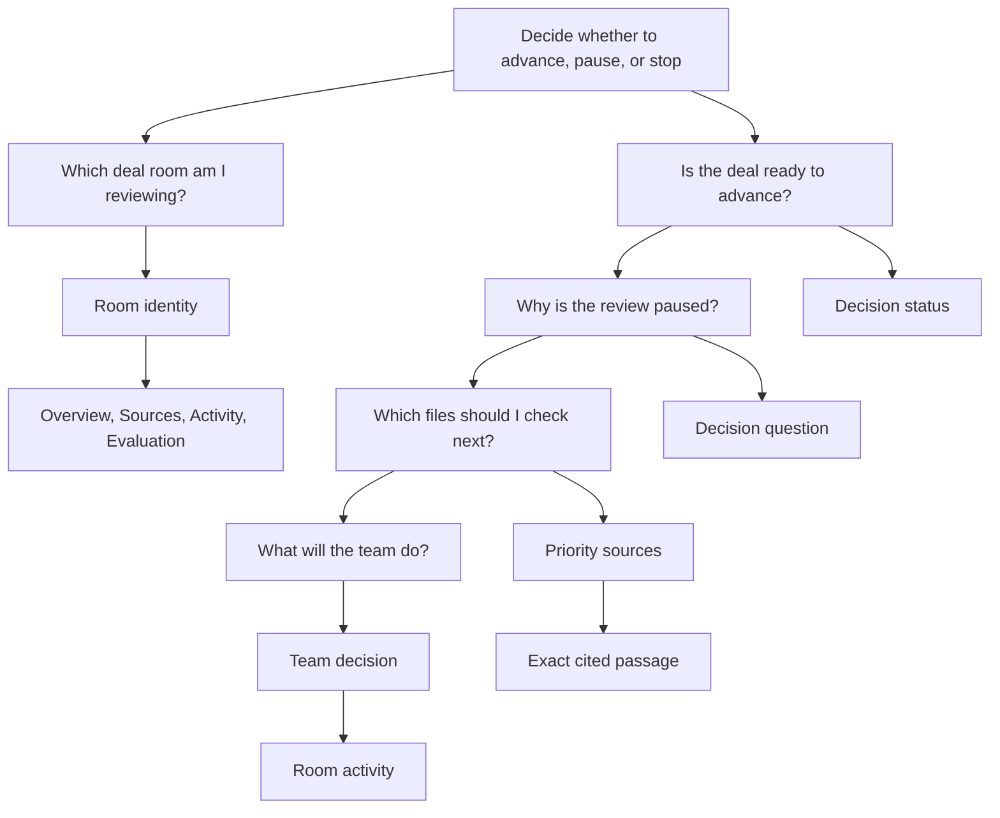

# Deal room content graph

Status: accepted for the customer demo  
Date: August 17, 2026

## Root job

The deal team must decide whether to advance, pause, or stop a deal, and know
what must happen next.

Every visible segment must answer a deal team question, support the next
decision, or provide the source needed to resolve uncertainty. A segment that
does none of these things must move to Room details or be removed.

## Segment defense

| Segment | User question | Why it is present | Why it is placed there |
| --- | --- | --- | --- |
| Current room | Which room am I reviewing? | It prevents work in the wrong room and provides the folder action. | It stays in the rail because room identity applies to every view. |
| Room identity | Which room am I reviewing? | It shows the deal, file count, scope, and file origin. | It stays above every room view. |
| Primary navigation | What work can I do here? | Overview supports the decision, Sources supports source checks, Activity supports coordination, and Evaluation supports review of room errors. | It follows room identity because every task belongs to the active room. |
| Decision status | Is the deal ready to advance? | It gives the current action state before supporting detail. | It is the first object on Overview after a review. |
| Pause reason | Why is the review paused? | It explains the source rule failure and tells the user what to do. | It follows the status because a pause without a reason is not useful. |
| Decision question | What was the review meant to resolve? | It keeps the review tied to the deal decision and material conflict. | It appears before sources because it explains why those sources were selected. |
| Priority sources | Which files should I check? | Each source button opens one exact passage. | It follows the question and precedes the team decision. |
| Team decision | What will the team do? | It records Advance, Pause, or Stop with notes. | It follows the reason and sources so the action is informed. |
| Sources | What does the cited file say? | It shows the file and cited passage. | It is a primary view because users may need more source context. |
| Activity | What has the team asked or recorded? | It keeps questions and notes with the room. | It is a primary view because coordination is part of the decision. |
| Evaluation | Where did the room conversation fail? | It records Pass, Fail, or Defer judgments against contextual Buzz traces. | It is a primary view because review must stay attached to the same room and canonical URL. |
| Room details | Is the room working and where are its files? | It contains file origin, local model state, room status, saved notes, and diagnostics. | It opens only on request because the information does not change the deal decision by default. |
| Decision notes | What did the team save? | It preserves the team record after a decision. | It is secondary until the team records a decision. |
| Technical details | Why did the room or analysis fail? | It supports troubleshooting. | It is secondary because provider and trace data do not help most deal decisions. |
| Open folder | Which files will become the room? | It previews the folder before creating the room. | It opens only when the user changes rooms. |

## Copy rules

The canonical copy and the reason for every phrase are stored in
[`web/content-graph.json`](../blueprints/deal-room-analyst/app/web/content-graph.json). The customer demo
validator checks the graph against the current HTML and JavaScript.

The following rules apply to new copy:

1. Use the deal team's objects, including deal, room, file, source, question,
   review, decision, and note.
2. Name the next action on buttons.
3. State the decision consequence before the system state.
4. Keep provider, relay, trace, parser, benchmark, and network terms outside
   the primary path.
5. Show one citation action per priority file. Do not show repeated citations
   or raw excerpts on Overview.
6. Remove a phrase when its absence would not change the user's next action or
   confidence in that action.
