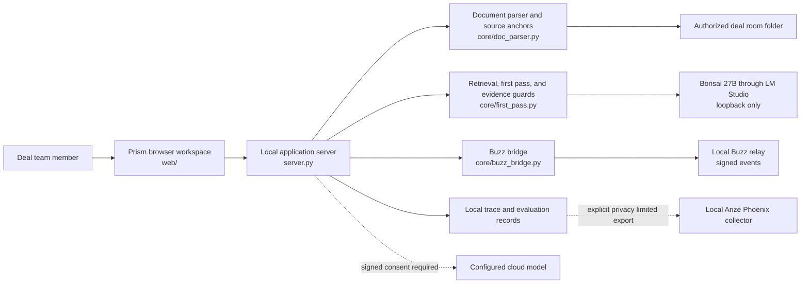
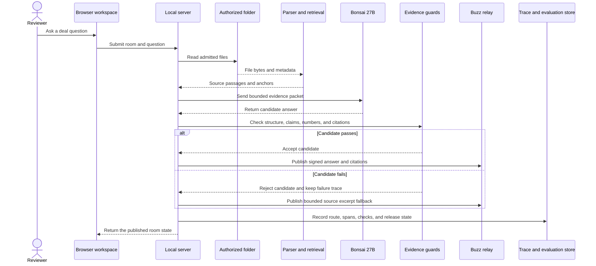
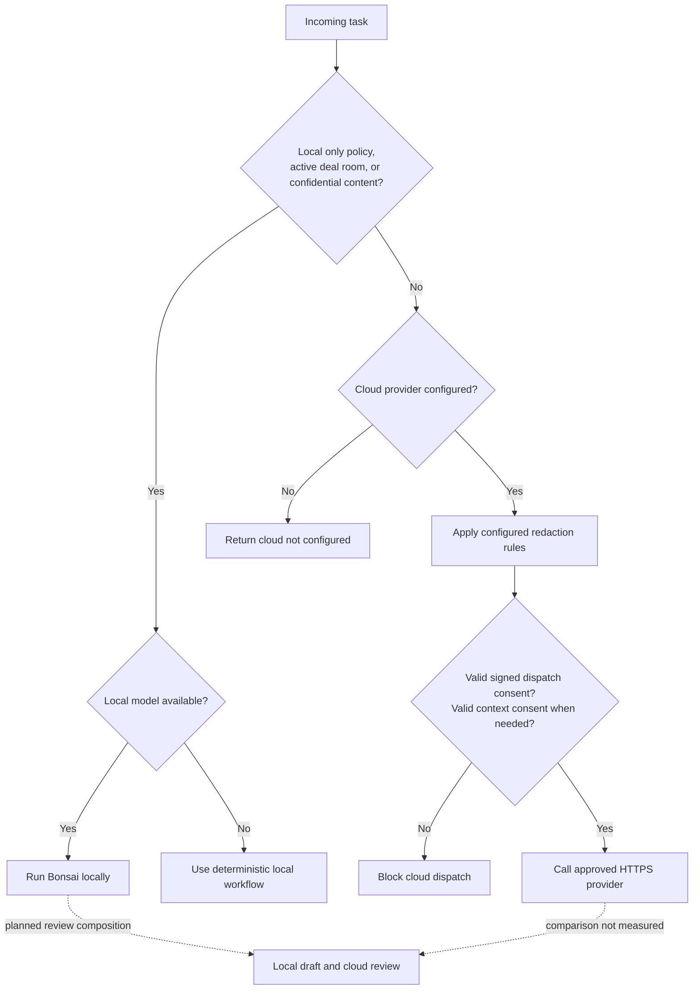
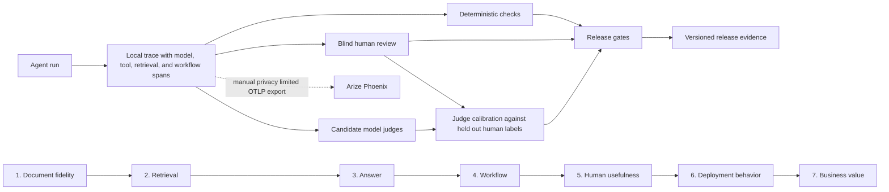
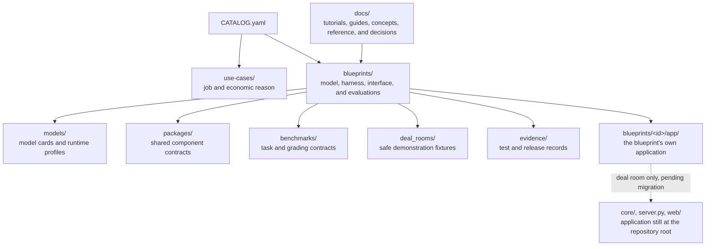

# Deal room blueprint architecture

The diagrams describe the deal room analyst only. Its application still lives
at the repository root (`core/`, `server.py`, `web/`) because it predates the
catalog; [ADR 0003](../ADR_0003_CATALOG_SCALING_PATTERN.md) records the target
structure and the migration. Other blueprints keep their application inside
their own directory and document it in their blueprint README.

Solid lines show working paths. Dotted lines show optional or incomplete
paths.

## System context

The browser uses one local server for the workspace and API. The server reads
only the folder selected by the operator. It reaches Bonsai through a loopback
endpoint and stores shared room events in the local Buzz relay.

## Local request path

The application separates the model draft from publication. A rejected draft
stays in its trace. The interface can show an evidence safe fallback, but the
fallback does not convert the rejected draft into a passing model result.

## Hybrid routing and consent

Deal room work uses the local route by default. A cloud route must be
configured by the operator, use HTTPS, redact known personal data, and receive
short lived signed consent. Cloud and hybrid benchmark runs have not been
completed.

The routing code lives in
[`core/hybrid_router.py`](../../blueprints/deal-room-analyst/app/core/hybrid_router.py). The provider boundary
lives in [`core/ai_provider.py`](../../blueprints/deal-room-analyst/app/core/ai_provider.py), and signed cloud
consent lives in [`core/cloud_consent.py`](../../blueprints/deal-room-analyst/app/core/cloud_consent.py).

## Evaluation and observability

The release process keeps each evaluation layer separate. A critical failure
in source fidelity, evidence, numbers, citations, or policy cannot be hidden by
an average score from another layer.

The local trace schema and checks live in
[`core/arize_evals.py`](../../blueprints/deal-room-analyst/app/core/arize_evals.py). The explicit Phoenix
exporter lives in
[`scripts/export_eval_review_to_phoenix.py`](../../blueprints/deal-room-analyst/app/scripts/export_eval_review_to_phoenix.py).
The [observability guide](../concepts/observability-and-evaluation.md) explains
the OpenTelemetry and OpenInference terms.

## Repository boundaries

Each blueprint manifest is the source of truth for that blueprint:
[deal room](../../blueprints/deal-room-analyst/blueprint.yaml) and
[CareLine](../../blueprints/careline-voice-checkin/blueprint.yaml). The
[catalog](../../CATALOG.yaml) is the source of truth for repository discovery.
