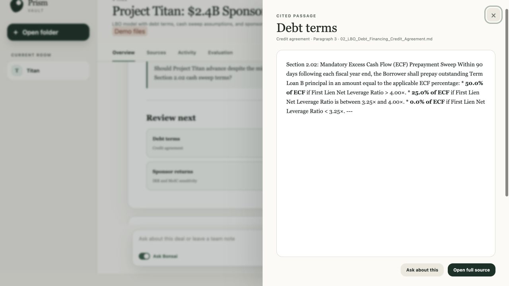
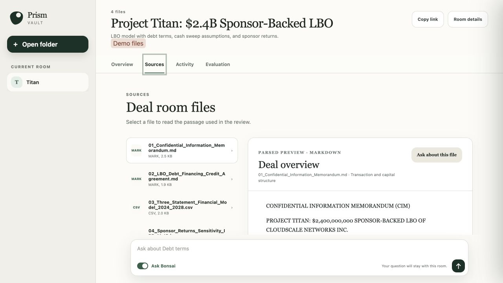
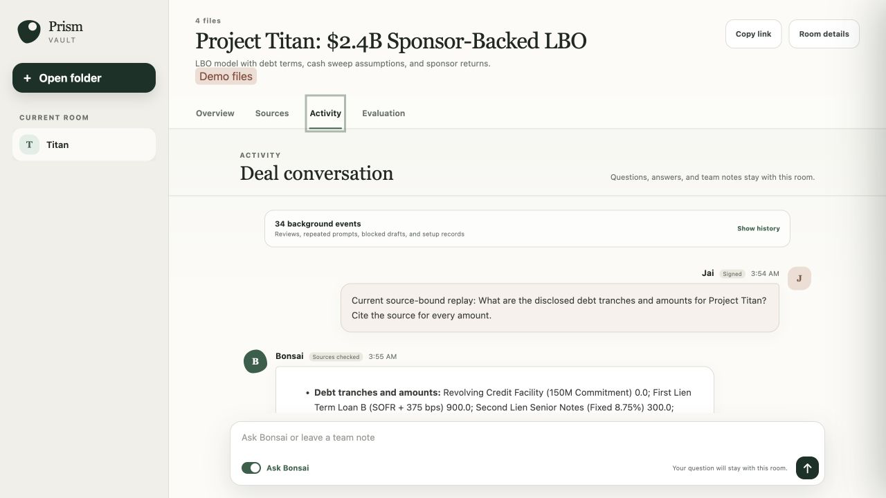
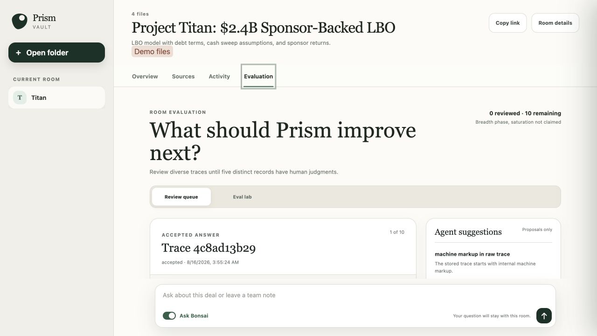
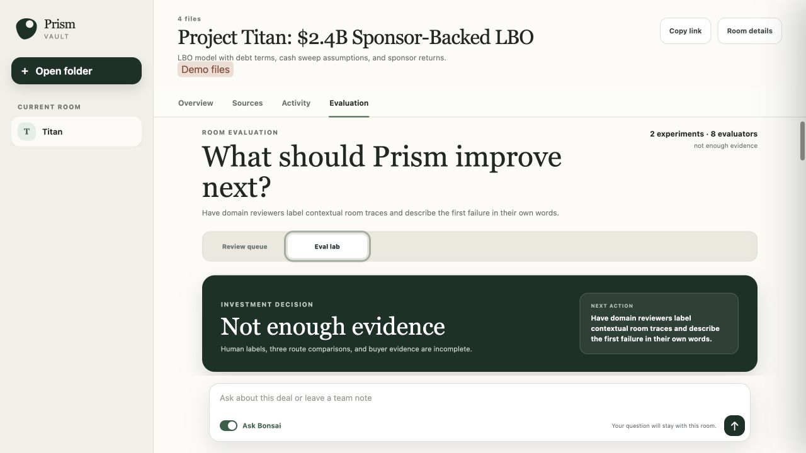

# Deal room demo tour

The Project Titan demo shows how a deal team reviews a local folder, checks the
evidence behind an answer, discusses the deal, and records evaluation results.
Project Titan is synthetic, so the screenshots are safe to publish.

The screenshots show the application state captured on August 18, 2026. The
[screenshot manifest](../assets/screenshots/manifest.json) records the source
commit, viewport, state, and file hash for each image.

## Review the decision

The Overview tab puts the decision before the generated brief. The current
example is paused because the model draft did not pass the source rules.

The pause is a system safety result. It is not a model recommendation.

## Check the cited passage

A reviewer can open each citation at the passage used by the answer. The
preview names the file and source location.

## Inspect the local files

The Sources tab lists the admitted files and renders the parsed document. The
demo includes Markdown, CSV, and JSON files.

## Discuss the deal in the room

The Activity tab keeps questions, answers, citations, and team notes with the
room. Buzz stores the shared messages as signed events.

## Review a full trace

The Review queue shows the contextual trace and keeps human labels separate
from agent suggestions. An agent suggestion does not become a human label
until a reviewer accepts it.

## Check release readiness

The Eval lab shows measured routes, missing comparisons, judge calibration,
and release gates. Missing cloud and hybrid runs remain marked as unmeasured.

## Continue

Follow the [getting started tutorial](../tutorials/run-the-deal-room-blueprint.md)
to run the same workflow. Read the [architecture guide](../architecture/README.md)
to see how the browser, model, Buzz, source files, and evaluations connect.
